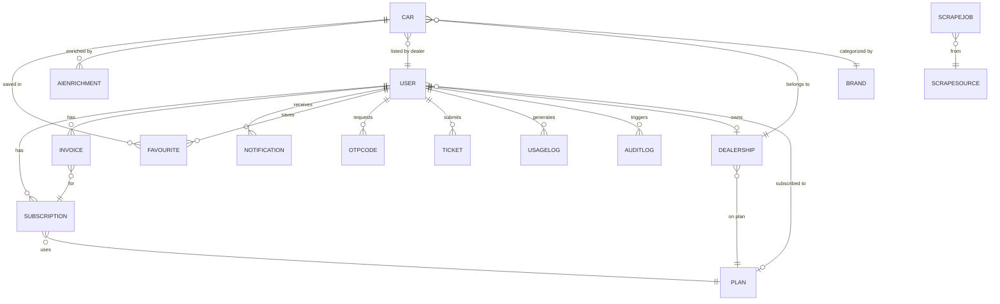

# 🚗 Drivest — AI-Powered Car Marketplace Platform

<div align="center">


**An enterprise-grade, AI-powered car marketplace platform combining real-time web scraping, machine learning price analysis, and a dealer management dashboard.**

</div>

---

## 📋 Table of Contents

- [Project Overview](#-project-overview)
- [Business Problem & Solution](#-business-problem--solution)
- [Key Features](#-key-features)
- [High-Level Architecture](#-high-level-architecture)
- [System Architecture Diagram](#-system-architecture-diagram)
- [Folder Structure](#-folder-structure)
- [Technology Stack](#-technology-stack)
- [Database Documentation](#-database-documentation)
- [API Documentation](#-api-documentation)
- [AI Service Documentation](#-ai-service-documentation)
- [Frontend Documentation](#-frontend-documentation)
- [Authentication & Authorization](#-authentication--authorization)
- [Third-Party Integrations](#-third-party-integrations)
- [Environment Variables](#-environment-variables)
- [Installation & Setup Guide](#-installation--setup-guide)
- [Available Scripts](#-available-scripts)
- [Security Implementation](#-security-implementation)
- [Real-Time Notifications](#-real-time-notifications)
- [Deployment](#-deployment)
- [Code Quality Report](#-code-quality-report)
- [Known Limitations & Technical Debt](#-known-limitations--technical-debt)
- [Future Improvements](#-future-improvements)

---

## 🌟 Project Overview

**Drivest** is an enterprise-grade, AI-powered car marketplace and dealer management platform. The system is built across three decoupled applications:

| Application | Framework | Language | Responsibility |
|---|---|---|---|
| **Backend API** | Node.js + Express | JavaScript (ESM) | REST APIs, Auth, Business Logic, Database |
| **Admin Dashboard** | Next.js 15 | JavaScript (JSX) | UI, Admin Operations, Real-time Notifications |
| **AI Service** | FastAPI | Python 3 | Web Scraping, ML Price Analysis, AI Recommendations |

The platform targets **car dealerships** operating in Belgium (with scraping targeting AutoScout24 BE/NL), providing them with a full-cycle tool: from automated car discovery via scraping to intelligent price analysis and a dealer subscription-based listing system.

---

## 💼 Business Problem & Solution

### Problem
Car dealerships struggle to:
- Manually monitor thousands of car listings across marketplaces
- Accurately assess whether a listing is priced fairly or profitably
- Manage their own listings and user base through a unified interface
- Receive real-time alerts when new relevant cars are found

### Solution
Drivest provides:
1. **Automated Scraping** — A Selenium-based scraper targets AutoScout24 every 7 days and pushes discovered cars directly into the database
2. **AI Price Analysis** — An ML model and heuristic engine evaluates each car's market value, profit potential, and investment risk
3. **Dealer Dashboard** — A Next.js admin panel for user management, listing oversight, revenue tracking, and real-time Pusher notifications
4. **Subscription Billing** — Stripe integration with webhook-based activation and invoice generation

---

## ✨ Key Features

### Backend
- 🔐 JWT-based authentication with access + refresh token pattern
- 👤 Role-based access control: `admin`, `dealer`, `user`
- 🔑 OTP-based password reset via email (Nodemailer)
- 🔍 Advanced car search with text index, geo-location (2dsphere), and filter support
- ⭐ Favorites / Wishlist system with toggle, add, remove, count, paginated retrieval
- 🔔 Real-time notifications via Pusher (private channels per admin)
- 💳 Stripe checkout session creation and webhook handler for subscription activation
- 📄 Invoice generation and storage (tied to Stripe `checkout.session.completed`)
- 🗑️ Global soft-delete plugin applied across all major collections
- 🖼️ Cloudinary image upload via Multer middleware
- 🎫 Support ticket creation
- 🚗 Car import API called by the AI service (`/ai/import-cars`)
- 🔗 Google OAuth login via `google-auth-library`
- 🔄 AutoScout24 integration as an external service

### AI Service
- 🤖 Automated Selenium web scraper targeting AutoScout24
- 🔁 7-day scheduler (OS Cron or Python `schedule` library)
- 🧪 Lock-file-based double-run protection during scraping
- 📊 Rule-based ML price analysis: market value estimation, profit calculation, risk scoring
- 🤝 `joblib`-based pre-trained ML model for price prediction
- 💬 OpenAI GPT-4o-mini integration for conversational car suggestions
- 🆚 Intelligent two-car comparison engine with 6-axis scoring
- 🔢 Brand-tier classification (Premium / Mid-Tier / Budget)
- 📦 Car data pipeline: Scrape → Convert → Push to Backend

### Frontend (Admin Dashboard)
- 📊 KPI Dashboard (Total Users, Total Income, Active Listings)
- 📈 Income Overview chart (monthly, year-selectable, powered by Recharts)
- 📈 User Growth chart (year-selectable)
- ✅ Verification Center (approve/reject dealer registrations)
- 🔔 Real-time notification bell (Pusher `private-admin-{id}` channel)
- 👤 Admin profile management with Cloudinary avatar upload
- 🚗 Listings Management page
- 👥 User Management page
- 🆘 Help Center
- ⚙️ Settings (Profile, Privacy Policy, Terms & Conditions, Refund Policy)
- 🔒 Cookie + LocalStorage JWT session management
- 🛡️ Next.js Middleware route protection for `/dashboard/**`

---

## 🏗️ High-Level Architecture

```
┌──────────────────────────────────────────────────────────────┐
│                       CLIENT LAYER                           │
│                 Next.js 15 Admin Dashboard                   │
│             (Tailwind CSS + Recharts + Pusher-js)            │
└──────────────────────┬───────────────────────────────────────┘
                       │ HTTP (Axios / Fetch)
                       ▼
┌──────────────────────────────────────────────────────────────┐
│                    API GATEWAY LAYER                         │
│              Node.js / Express REST API (ESM)                │
│  Auth · Cars · Admin · Users · Subscriptions · Notifications │
│  Middleware: JWT Auth · Role Check · Subscription Check      │
└────────────┬─────────────────────────────┬───────────────────┘
             │ Mongoose ODM                │ Internal HTTP POST
             ▼                            ▼
┌────────────────────┐       ┌────────────────────────────────┐
│  MongoDB Database  │       │     FastAPI AI Service         │
│  (15+ Collections) │       │  Selenium Scraper + ML Engine  │
│  Soft Delete Plugin│       │  OpenAI GPT-4o-mini            │
└────────────────────┘       └────────────────────────────────┘
             │                            │
             ▼                            ▼
   Cloudinary (Images)         AutoScout24 (Scraped Data)
   Stripe (Payments)           OpenAI API (AI Suggestions)
   Pusher (Real-time)
   Nodemailer (Email)
```

---

## 📐 System Architecture Diagram

```mermaid
graph TB
    subgraph FE["Frontend [Next.js 15]"]
        A[Admin Dashboard] --> B[Login Page]
        A --> C[Dashboard Page]
        A --> D[Listings Management]
        A --> E[User Management]
        A --> F[Notifications]
        A --> G[Profile / Settings]
        H[SimpleProvider] -->|Pusher Client| A
        I[Next.js Middleware] -->|JWT Cookie Guard| A
    end

    subgraph BE["Backend [Node.js / Express]"]
        J[server.js] --> K[globalRoutes]
        J --> L[adminRoutes]
        J --> M[userRoutes]
        J --> N[aiRoutes]
        J --> O[subscriptionRoutes]
        J --> P[pusherRoutes]
        K --> Q[authController]
        K --> R[googleLogin]
        L --> S[carController]
        L --> T[userController]
        L --> U[subscriptionController]
        N --> V[aiController]
        P --> W[Pusher Auth]
        X[authMiddleware] -.->|JWT Verify| L
        X -.->|JWT Verify| M
        Y[roleMiddleware] -.->|isAdmin/isDealer/isUser| L
        Z[checkSubscription] -.->|Trial/Sub Check| M
    end

    subgraph AI["AI Service [FastAPI]"]
        AA[main.py] --> AB[routes.py]
        AB --> AC[analyze-cars]
        AB --> AD[compare-cars]
        AB --> AE[ai-suggest]
        AB --> AF[compare-two-cars]
        AB --> AG[analyze-single-car]
        AA --> AH[run-scraper]
        AH --> AI2[automator.py]
        AI2 --> AJ[autoscout24_scraper.py]
        AI2 --> AK[convert_scraped_data.py]
        AI2 --> AL[push_to_backend]
    end

    subgraph EXT["External Services"]
        AM[MongoDB Atlas]
        AN[Cloudinary]
        AO[Stripe]
        AP[Pusher]
        AQ[OpenAI GPT-4o-mini]
        AR[AutoScout24]
        AS[Google OAuth]
        AT[Nodemailer SMTP]
    end

    A -->|Bearer Token| J
    V -->|import-cars| S
    AI2 -->|POST /ai/import-cars| J
    J --- AM
    J --- AN
    J --- AO
    J --- AP
    J --- AT
    AE --- AQ
    AJ --- AR
    R --- AS
```



---

## 📁 Folder Structure

```
projects_3_drivest_ai_car_app/
├── backend/
│   ├── api/index.js                        # Vercel serverless entry point
│   ├── src/
│   │   ├── server.js                       # Main Express app entry
│   │   ├── app.js                          # Legacy/secondary app (unused)
│   │   ├── config/
│   │   │   ├── cloudinary.js               # Cloudinary v2 SDK config
│   │   │   ├── dbConnect.js                # MongoDB connection
│   │   │   ├── firebaseAdmin.js            # Firebase SDK (configured, unused in routes)
│   │   │   ├── pusher.js                   # Pusher server SDK
│   │   │   └── rapidClient.js              # RapidAPI client (configured, unused in routes)
│   │   ├── controllers/
│   │   │   ├── authController.js           # Register, Login, RefreshToken, OTP, Reset
│   │   │   ├── aiController.js             # importCars, importCarsSummary
│   │   │   ├── carController.js            # searchCars, getCarDetails, compareCars
│   │   │   ├── favoriteController.js       # Toggle, Add, Remove, List, Count
│   │   │   ├── globalController.js         # getUserFavorites (public)
│   │   │   ├── googleLogin.js              # Google OAuth token verify
│   │   │   ├── notificationController.js   # Get, Delete, MarkRead, MarkAllRead
│   │   │   ├── subscriptionController.js   # Stripe Session, Webhook, Invoices
│   │   │   ├── ticketController.js         # createTicket
│   │   │   ├── brandController.js          # getBrands
│   │   │   ├── userController.js           # Admin user management
│   │   │   └── userProfileController.js    # editProfile, resetPassword, deleteUser
│   │   ├── middleware/
│   │   │   ├── authMiddleware.js           # Bearer JWT verification + live DB lookup
│   │   │   ├── roleMiddleware.js           # isAdmin, isDealer, isUser
│   │   │   ├── checkSubscription.js        # Trial / subscription gate
│   │   │   └── errorHandler.js            # Global error handler
│   │   ├── models/
│   │   │   ├── User.js
│   │   │   ├── Car.js                      # Most complex model (geo, text, VIN indexes)
│   │   │   ├── Brand.js
│   │   │   ├── Favourite.js
│   │   │   ├── Notification.js
│   │   │   ├── Ticket.js
│   │   │   ├── Plan.js
│   │   │   ├── Subscription.js
│   │   │   ├── Invoice.js
│   │   │   ├── Lead.js
│   │   │   ├── Dealership.js
│   │   │   ├── OtpCode.js
│   │   │   ├── AiEnrichment.js
│   │   │   ├── ScrapeJob.js
│   │   │   ├── UsageLog.js
│   │   │   └── AuditLog.js
│   │   ├── routes/
│   │   │   ├── globalRoutes.js             # Public auth routes
│   │   │   ├── adminRoutes.js              # Admin-only routes
│   │   │   ├── userRoutes.js               # Authenticated user routes
│   │   │   ├── aiRoutes.js                 # AI service import routes
│   │   │   ├── subscriptionRoutes.js       # Stripe routes
│   │   │   └── pusherRoutes.js             # Pusher auth endpoint
│   │   ├── service/
│   │   │   └── autoscoutService.js         # AutoScout24 HTTP client (unused in routes)
│   │   ├── storage/
│   │   │   └── imageParser.js              # Multer + CloudinaryStorage
│   │   └── lib/
│   │       ├── DevBuildError.js            # Custom error class with statusCode
│   │       ├── emailTemplates.js           # HTML email templates (6 templates)
│   │       ├── generateToken.js            # Access + refresh JWT generation
│   │       ├── mailer.js                   # Nodemailer SMTP wrapper
│   │       ├── notify.js                   # Pusher trigger helper
│   │       ├── softDeletePlugin.js         # Global Mongoose soft-delete plugin
│   │       └── utilityFunction.js          # Misc helpers
│   ├── package.json
│   └── vercel.json
│
├── frontend/
│   ├── app/
│   │   ├── layout.js                       # Root layout (Google Fonts)
│   │   ├── page.js                         # Root → renders LogIn
│   │   ├── LogIn.jsx                       # Login form (JWT → Cookie + localStorage)
│   │   ├── SimpleProvider.jsx              # NotificationContext + Pusher subscription
│   │   ├── globals.css
│   │   ├── component/
│   │   │   ├── Sidebar.jsx                 # Nav + logout
│   │   │   ├── Topbar.jsx                  # Notification bell + profile
│   │   │   ├── IncomeBar.jsx               # Monthly income Recharts bar chart
│   │   │   ├── GrowthBar.jsx               # User growth Recharts bar chart
│   │   │   ├── Li.jsx                      # Sidebar nav item
│   │   │   ├── Container.jsx               # Layout wrapper
│   │   │   ├── Header.jsx
│   │   │   └── TextToolbar.jsx
│   │   └── (protected)/
│   │       ├── layout.js                   # Protected layout (Sidebar + Topbar)
│   │       ├── dashboard/page.js           # KPIs + charts + verification table
│   │       ├── listings/management/        # Car listings management
│   │       ├── user/management/            # User management
│   │       ├── agent/                      # Agent management (incomplete, sidebar disabled)
│   │       ├── notifications/              # Notification list
│   │       ├── profile/                    # Profile edit
│   │       ├── help/center/               # Help center
│   │       ├── reports/                    # Reports
│   │       ├── verification/               # Full verification center
│   │       ├── privacy/policy/
│   │       ├── terms/conditions/
│   │       └── refund/policy/
│   ├── components/ui/                      # Radix UI component library
│   ├── lib/
│   │   ├── apiConfig.js                    # API_BASE URL from env
│   │   ├── auth.js                         # next-auth config (legacy/dev only)
│   │   ├── pusherClient.js                 # Pusher-js client
│   │   └── utils.js                        # clsx + tailwind-merge
│   ├── middleware.js                       # JWT cookie guard for /dashboard/**
│   ├── next.config.mjs
│   └── package.json
│
└── ai-part/
    ├── app/
    │   ├── main.py                         # FastAPI entry + CORS + health + run-scraper
    │   ├── routes.py                       # All AI analysis + recommendation endpoints
    │   ├── models.py                       # Pydantic schemas
    │   ├── ai_calculations.py              # ML analysis, OpenAI suggestion logic
    │   ├── car_recommendation_engine.py    # 6-axis scoring + two-car comparison
    │   └── Cars data api ready.json        # Cleaned car dataset
    ├── scrapers/
    │   ├── autoscout24_working_scraper.py  # Selenium scraper (AutoScout24 BE/NL)
    │   ├── automator.py                    # Orchestrator: scrape → convert → push
    │   ├── scheduler.py                    # Python schedule (every 7 days)
    │   ├── output.json                     # Raw scrape output
    │   └── output_test.json                # Test sample
    ├── scripts/
    │   ├── convert_scraped_data.py
    │   ├── clean_real_data_only.py
    │   ├── show_data_summary.py
    │   ├── test_ml_model.py
    │   └── test_price_prediction.py
    ├── data/
    │   ├── raw/cars_data.json
    │   └── ml_models/ml_model.joblib       # Pre-trained scikit-learn model
    └── requirements.txt
```

---

## 🛠️ Technology Stack

### Backend Technologies

| Category | Technology | Version | Purpose |
|---|---|---|---|
| Runtime | Node.js | Current LTS | JavaScript runtime |
| Framework | Express.js | ^4.x | REST API framework |
| Language | JavaScript (ESM) | ES2022+ | `import/export` modules throughout |
| ODM | Mongoose | Latest | MongoDB object modeling |
| Auth | jsonwebtoken | Latest | JWT access + refresh tokens |
| Auth | google-auth-library | Latest | Google OAuth ID token verification |
| Payments | Stripe | Latest | Subscription checkout + webhooks |
| Real-time | Pusher | Latest | WebSocket-based notifications |
| Upload | Multer | Latest | Multipart form data parsing |
| Upload | multer-storage-cloudinary | Latest | Cloudinary upload via Multer |
| Images | Cloudinary SDK v2 | Latest | Cloud image hosting |
| Email | Nodemailer | Latest | SMTP email delivery |
| Crypto | bcryptjs | Latest | Password hashing |
| Environment | dotenv | Latest | Environment variable loading |
| Firebase | firebase-admin | Latest | Configured but unused in active routes |
| HTTP | axios | Latest | RapidAPI client (configured, unused) |
| Deployment | Vercel | v2 | Serverless Node.js hosting |

### Frontend Technologies

| Category | Technology | Version | Purpose |
|---|---|---|---|
| Framework | Next.js | 15.5.19 | React framework with App Router |
| React | React | 19.1.0 | UI library |
| Build | Turbopack | — | Dev/build (`--turbopack` flag) |
| Styling | Tailwind CSS | ^4 | Utility-first CSS |
| UI Primitives | Radix UI | Various | Select, Separator, Slot, Toggle, ToggleGroup |
| Icons | Lucide React | ^0.544.0 | SVG icon library |
| Icons | React Icons | ^4.12.0 | Additional icon sets (fa, md, io) |
| HTTP | Axios | ^1.12.2 | API calls with auth header defaults |
| Cookies | js-cookie | ^3.0.5 | Client-side cookie management |
| Notifications | react-hot-toast | ^2.6.0 | Toast notification UI |
| Charts | Recharts | ^3.2.1 | Income + Growth bar charts |
| Real-time | pusher-js | ^8.4.0 | Pusher WebSocket client |
| Push Notif | @pusher/push-notifications-web | ^1.1.0 | Declared (usage unconfirmed) |
| Fonts | Google Fonts (Next.js) | — | Inter, Poppins, Noto Serif, Geist, Geist Mono |
| Utilities | clsx + tailwind-merge | Latest | Conditional class merging |
| Auth | next-auth | — | Credential provider (legacy/dev, not production) |

### AI Technologies

| Category | Technology | Version | Purpose |
|---|---|---|---|
| Framework | FastAPI | 0.115.6 | Python REST API framework |
| Server | Uvicorn | 0.34.0 | ASGI server |
| Validation | Pydantic | 2.10.3 | Request/response schema validation |
| Web Scraping | Selenium | 4.21.0 | Headless browser automation |
| Web Scraping | webdriver-manager | 4.0.1 | ChromeDriver auto-management |
| Scraping | BeautifulSoup4 | 4.12.3 | HTML parsing |
| HTTP | requests | 2.32.3 | HTTP calls to backend API |
| HTTP | httpx | >=0.27.2 | Async HTTP client |
| ML | scikit-learn | 1.6.0 | Pre-trained price prediction model |
| ML | joblib | — | Model serialization/loading |
| ML | numpy | 2.2.1 | Numerical arrays for ML features |
| Data | pandas | 2.2.3 | Data manipulation |
| AI | openai | >=1.50.0 | GPT-4o-mini car suggestion API |
| Scheduler | schedule | 1.2.2 | Python-based 7-day cron |
| Environment | python-dotenv | 1.0.1 | `.env` file loading |

---

## 🗄️ Database Documentation

The MongoDB database contains **15+ collections**. Below is full schema documentation.

---

### Collection: `users`

| Field | Type | Required | Default | Notes |
|---|---|---|---|---|
| `name` | String | ✅ | — | Full name |
| `email` | String | ✅ | — | Unique, lowercase |
| `password` | String | ✅ | — | bcrypt-hashed |
| `phone` | String | — | — | |
| `role` | String (enum) | — | `"user"` | `admin`, `dealer`, `user` |
| `status` | String (enum) | — | `"pending"` | `pending`, `active`, `inactive`, `suspended` |
| `image` | String | — | — | Profile image URL (Cloudinary) |
| `verificationStatus` | String (enum) | — | `"pending"` | `pending`, `verified`, `rejected` |
| `hasActiveSubscription` | Boolean | — | `false` | Set on Stripe webhook |
| `subscriptionId` | ObjectId → Subscription | — | — | |
| `subscriptionStart` | Date | — | — | |
| `subscriptionEnd` | Date | — | — | |
| `subscriptionPlanName` | String | — | — | Quick display cache |
| `subscriptionStatus` | String | — | — | Mirror of Subscription.status |
| `lastSubscriptionPaymentAt` | Date | — | — | |
| `stripeCustomerId` | String | — | — | |
| `trialEnd` | Date | — | — | Set on registration |
| `isTrialUsed` | Boolean | — | `false` | Set true after trial ends |
| `dealershipId` | ObjectId → Dealership | — | — | |
| `isDeleted` | Boolean | — | `false` | Soft delete plugin |
| `deletedAt` | Date | — | — | Soft delete plugin |
| `deletedBy` | ObjectId → User | — | — | Soft delete plugin |
| `deleteReason` | String | — | — | Soft delete plugin |
| `createdAt` | Date | auto | — | Mongoose timestamp |
| `updatedAt` | Date | auto | — | Mongoose timestamp |

**Indexes:** `email` (unique), `role`, `status`

---

### Collection: `cars`

> The most complex schema. Includes geospatial, text, and sparse indexes.

| Field | Type | Required | Default | Notes |
|---|---|---|---|---|
| `title` | String | ✅ | — | Listing title |
| `brand` | String | — | — | Car brand |
| `make` | String | — | — | Manufacturer |
| `model` | String | — | — | Model name |
| `year` | Number | — | — | Manufacturing year |
| `price` | Number | — | — | Listed price |
| `mileage` | Number | — | — | km |
| `fuelType` | String | — | — | petrol/diesel/electric/hybrid |
| `bodyType` | String | — | — | sedan/SUV/etc. |
| `transmission` | String | — | — | manual/automatic |
| `color` | String | — | — | |
| `image` | [String] | — | — | Array of image URLs |
| `description` | String | — | — | Full text |
| `vin` | String | — | — | VIN (sparse unique index) |
| `source` | String (enum) | — | `"manual"` | `manual`, `scraped`, `imported` |
| `sourceUrl` | String | — | — | Original listing URL |
| `status` | String (enum) | — | `"active"` | `active`, `inactive`, `pending`, `sold` |
| `location.address` | String | — | — | |
| `location.city` | String | — | — | |
| `location.country` | String | — | — | |
| `location.geo` | GeoJSON Point | — | — | 2dsphere indexed |
| `dealerId` | ObjectId → User | — | — | Owning dealer |
| `dealershipId` | ObjectId → Dealership | — | — | |
| `viewCount` | Number | — | `0` | |
| `favoriteCount` | Number | — | `0` | |
| `features` | [String] | — | — | Feature tags |
| `aiScore` | Number | — | — | AI-computed score |
| `isDeleted` | Boolean | — | `false` | Soft delete plugin |

**Indexes:** `2dsphere` on `location.geo`, text index on title/brand/model/description/fuelType/bodyType, sparse unique on `vin`, compound on `brand+status`, `dealerId+status`, `source+status`

---

### Collection: `subscriptions`

| Field | Type | Required | Default | Notes |
|---|---|---|---|---|
| `subscriberId` | ObjectId → User | ✅ | — | |
| `planName` | String | ✅ | — | e.g. `"Pro Plan"` |
| `stripeSubscriptionId` | String | — | — | |
| `stripeCustomerId` | String | — | — | |
| `startDate` | Date | — | — | |
| `endDate` | Date | — | — | +1 month on checkout completion |
| `status` | String (enum) | — | — | `active`, `cancelled`, `expired`, `trial` |
| `limits.maxListings` | Number | — | `50` | Hard-coded on Pro Plan |
| `limits.aiCredits` | Number | — | `1000` | Hard-coded on Pro Plan |
| `limits.teamMembers` | Number | — | `1` | Hard-coded on Pro Plan |

---

### Collection: `invoices`

| Field | Type | Required | Default | Notes |
|---|---|---|---|---|
| `userId` | ObjectId → User | ✅ | — | |
| `subscriptionId` | ObjectId → Subscription | — | — | |
| `planId` | ObjectId → Plan | — | — | |
| `invoiceNumber` | String | — | — | `INV-{Date.now()}` |
| `amount` | Number | ✅ | — | Pre-tax |
| `currency` | String | — | `"USD"` | |
| `taxAmount` | Number | — | `0` | |
| `totalAmount` | Number | ✅ | — | |
| `status` | String (enum) | — | `"unpaid"` | `paid`, `unpaid`, `failed`, `refunded` |
| `paymentIntentId` | String | — | — | Stripe |
| `stripeInvoiceId` | String | — | — | Stripe subscription ID |
| `paymentMethod` | String (enum) | — | `"card"` | `card`, `paypal`, `bank`, `manual` |
| `paidAt` | Date | — | — | |
| `periodStart` | Date | — | — | |
| `periodEnd` | Date | — | — | |
| `pdfUrl` | String | — | — | Stripe invoice PDF |
| `metadata` | Mixed | — | — | |

**Indexes:** `{ userId, status }`, `{ paymentIntentId }`

---

### Collection: `notifications`

| Field | Type | Required | Default | Notes |
|---|---|---|---|---|
| `userId` | ObjectId → User | ✅ | — | Recipient |
| `title` | String | ✅ | — | |
| `message` | String | ✅ | — | |
| `type` | String (enum) | — | `"info"` | `info`, `warning`, `success`, `error` |
| `status` | String (enum) | — | `"unread"` | `unread`, `read` |
| `seenAt` | Date | — | — | Set when marked read |
| `link` | String | — | — | Optional deep link |
| `relatedId` | ObjectId | — | — | Related entity ID |

---

### Collection: `otpcodes`

| Field | Type | Required | Default | Notes |
|---|---|---|---|---|
| `userId` | ObjectId → User | ✅ | — | |
| `otp` | String | ✅ | — | |
| `otpType` | String (enum) | ✅ | — | `login`, `reset_password`, `email_verification`, `phone_verification`, `other` |
| `expiresAt` | Date | ✅ | — | ~10 min |
| `ipAddress` | String | — | — | |
| `status` | String (enum) | — | `"pending"` | `used`, `expired`, `pending` |
| `notes` | String | — | — | |

**Indexes:** `{ userId, otpType }`, `{ status, expiresAt DESC }`

---

### Collection: `aiEnrichments`

| Field | Type | Required | Default | Notes |
|---|---|---|---|---|
| `carId` | ObjectId → Car | ✅ | — | |
| `jobType` | String (enum) | ✅ | — | `normalize`, `valuation`, `dedupe`, `embed` |
| `input` | Mixed | ✅ | — | Raw data before enrichment |
| `output` | Mixed | — | — | Processed result |
| `model` | String | — | — | AI model used |
| `confidence` | Number | — | — | Confidence score (0-1) |
| `embeddingId` | ObjectId → Embedding | — | — | Vector embedding reference |
| `status` | String (enum) | — | `"pending"` | `pending`, `completed`, `failed` |

---

### Collection: `scrapejobs`

| Field | Type | Required | Default | Notes |
|---|---|---|---|---|
| `sourceId` | ObjectId → ScrapeSource | ✅ | — | |
| `status` | String (enum) | — | `"queued"` | `queued`, `running`, `success`, `failed` |
| `startedAt` | Date | — | — | |
| `finishedAt` | Date | — | — | |
| `stats.found` | Number | — | `0` | |
| `stats.created` | Number | — | `0` | |
| `stats.updated` | Number | — | `0` | |
| `stats.skipped` | Number | — | `0` | |
| `stats.duplicates` | Number | — | `0` | |
| `error` | String | — | — | |
| `createdBy` | ObjectId → User | — | — | |

---

### Collection: `dealerships`

| Field | Type | Required | Default | Notes |
|---|---|---|---|---|
| `name` | String | ✅ | — | |
| `slug` | String | — | — | Soft-delete-safe unique index |
| `ownerUserId` | ObjectId → User | ✅ | — | |
| `contact.phone` | String | — | — | |
| `contact.email` | String | — | — | |
| `location.city` | String | — | — | |
| `location.country` | String | — | — | |
| `location.geo` | GeoJSON Point | — | — | 2dsphere index |
| `branding.logoUrl` | String | — | — | |
| `branding.theme` | Mixed | — | — | |
| `planId` | ObjectId → Plan | — | — | |
| `limits.maxListings` | Number | — | `50` | |
| `limits.aiCredits` | Number | — | `1000` | |
| `status` | String (enum) | — | `"active"` | `active`, `inactive`, `suspended` |
| `isDeleted` | Boolean | — | `false` | Soft delete plugin |

---

### Collection: `auditlogs`

| Field | Type | Required | Default | Notes |
|---|---|---|---|---|
| `userId` | ObjectId → User | ✅ | — | Actor |
| `actionType` | String (enum) | ✅ | — | `create`, `update`, `delete`, `login`, `logout`, `other` |
| `entityType` | String | ✅ | — | e.g. `"Car"`, `"User"` |
| `entityId` | ObjectId | ✅ | — | |
| `description` | String | ✅ | — | |
| `ipAddress` | String | — | — | |
| `userAgent` | String | — | — | |
| `actionTimestamp` | Date | — | `Date.now` | |
| `metadata` | Mixed | — | — | |

---

### Collection: `usagelogs`

| Field | Type | Required | Default | Notes |
|---|---|---|---|---|
| `userId` | ObjectId → User | ✅ | — | |
| `planId` | ObjectId → Plan | ✅ | — | |
| `usageType` | String (enum) | ✅ | — | `listing`, `ai_usage`, `scraping`, `other` |
| `description` | String | ✅ | — | |
| `amount` | Number | ✅ | — | Units consumed |
| `usedAt` | Date | — | `Date.now` | |
| `relatedId` | ObjectId → Car | — | — | |
| `status` | String (enum) | — | `"processed"` | `processed`, `pending` |

---

### Entity Relationship Diagram



---

## 🌐 API Documentation

### Base URL

| Environment | URL |
|---|---|
| Development | `http://localhost:5000` |
| Production | Configured via `NEXT_PUBLIC_LIVE_BASE_URL` / `NEXT_PUBLIC_API_BASE_URL` |
| AI Service | `http://localhost:8000` (configured via `NODE_API_URL`) |

### Standard Response Format

```json
// Success
{ "success": true, "message": "...", "data": {} }

// Error
{ "success": false, "message": "...", "stack": "..." }
```

### Error Codes

| HTTP Code | Cause |
|---|---|
| `400` | ValidationError, CastError, duplicate key |
| `401` | Missing / expired / invalid JWT |
| `403` | Insufficient role, trial expired |
| `404` | Resource not found |
| `409` | MongoDB duplicate key (code 11000) |
| `500` | Unhandled server error |

---

### Public Routes

| Method | Endpoint | Description | Auth |
|---|---|---|---|
| POST | `/register` | Register new user account | None |
| POST | `/login` | Authenticate user, get JWT tokens | None |
| POST | `/refresh-token` | Exchange refresh token for new access token | Refresh token |
| POST | `/forgot-password` | Send OTP to email | None |
| POST | `/verify-otp` | Verify submitted OTP | None |
| POST | `/reset-password` | Reset password after OTP verified | None |
| POST | `/google-login` | Authenticate via Google ID token | None |
| GET | `/user-favorites/:id` | Get public favorites for a user | None |

---

### User Routes (`/api/**` — Bearer JWT required)

| Method | Endpoint | Description |
|---|---|---|
| GET | `/api/profile` | Get own profile |
| PUT | `/api/edit-profile` | Update profile + avatar (multipart/form-data) |
| PUT | `/api/change-password` | Change password |
| POST | `/api/create-ticket` | Submit support ticket |
| GET | `/api/brands` | List all car brands |
| GET | `/api/get-brands` | Get unique brands from Car collection |
| GET | `/api/cars` | Search cars (text, filters, pagination) |
| GET | `/api/cars-details/:id` | Get single car details |
| GET | `/api/cars/compare` | Compare cars by IDs |
| POST | `/api/favorites/toggle` | Toggle car in/out of favorites |
| POST | `/api/favorites` | Add car to favorites (idempotent) |
| DELETE | `/api/favorites/:carId` | Remove car from favorites |
| GET | `/api/favorites` | Get paginated favorites list |
| GET | `/api/favorites/:carId/is-favorited` | Check if car is favorited |
| GET | `/api/cars/:carId/favorites/count` | Get favorite count for a car |
| GET | `/api/notifications` | Get last 50 notifications |
| PUT | `/api/notification-read` | Mark specific notifications as read |
| PUT | `/api/notifications-all-read` | Mark all notifications as read |
| DELETE | `/api/notification/:id` | Delete a notification |
| DELETE | `/api/delete-account` | Soft-delete own account |
| GET | `/api/invoices` | Get own invoices |

---

### Admin Routes (`/admin/**` — Bearer JWT + `isAdmin` required)

| Method | Endpoint | Description |
|---|---|---|
| GET | `/admin/profile` | Get admin's profile |
| GET | `/admin/user-list` | Get all users (no pagination) |
| PUT | `/admin/approved-user/:id` | Set user status to `active` |
| PUT | `/admin/reject-user/:id` | Set user status to `inactive` |
| GET | `/admin/cars` | Get all car listings (paginated) |
| GET | `/admin/invoices` | Get all invoices in the system |
| PUT | `/admin/notifications-all-read` | Mark admin notifications as read |

---

### AI Routes (`/ai/**`)

| Method | Endpoint | Description | Auth |
|---|---|---|---|
| POST | `/ai/import-cars` | Bulk import scraped cars | Internal (no token) |
| POST | `/ai/import-summary` | Send import count notification | Internal |

---

### Subscription Routes

| Method | Endpoint | Description | Auth |
|---|---|---|---|
| POST | `/subscription/create` | Create Stripe Checkout Session | Bearer JWT |
| POST | `/stripe/webhook` | Stripe webhook handler | Stripe signature |

---

### Pusher Route

| Method | Endpoint | Description | Auth |
|---|---|---|---|
| POST | `/api/pusher/auth` | Authenticate Pusher private channel | Bearer JWT |

---

## 🤖 AI Service Documentation

### FastAPI Endpoints

| Method | Endpoint | Description |
|---|---|---|
| GET | `/` | Service info + endpoint map |
| GET | `/health` | Health check (OpenAI key + Node URL) |
| POST | `/run-scraper` | Trigger scraper as BackgroundTask |
| POST | `/analyze-cars/` | Analyze list of cars (profit/risk/recommendation) |
| POST | `/compare-cars/` | Compare cars → best by profit/risk/overall |
| POST | `/ai-suggest/` | OpenAI GPT-4o-mini car suggestion |
| POST | `/compare-two-cars/` | AI two-car comparison with scoring |
| POST | `/analyze-single-car/` | Single car analysis vs user context |
| GET | `/cars/list` | First 10 cars from dataset |
| GET | `/cars/stats` | Price/year range + top-5 brands |
| GET | `/ai-engine/health` | CarRecommendationEngine health check |
| GET | `/test-analysis/` | Dev test with Tesla + BMW sample |

Interactive Swagger docs: `http://localhost:8000/docs`

---

### Car Recommendation Engine (6-Axis Scoring)

The `CarRecommendationEngine` class in `car_recommendation_engine.py` scores cars across **6 weighted axes**:

| Axis | Weight | Signal Used |
|---|---|---|
| `price` | 25% | Budget fit + ML fairness comparison |
| `value` | 20% | Actual vs. predicted price savings |
| `reliability` | 20% | Brand reliability score + age penalty (5%/year) |
| `features` | 15% | Seat count, gearbox match, modern feature keywords |
| `fuel_efficiency` | 10% | Fuel type match + hybrid/EV bonus |
| `safety` | 10% | ABS, airbag, ESP, camera keyword presence (8% each) |

**Built-in Brand Reliability Scores:**

| Brand | Score |
|---|---|
| Toyota / Lexus | 0.95 |
| Honda | 0.90 |
| Mazda | 0.88 |
| Volvo | 0.85 |
| Volkswagen | 0.80 |
| Ford | 0.78 |
| BMW / Mercedes / Audi | 0.75 |

**Recommendation Labels (ai_calculations.py):**

| Label | Condition |
|---|---|
| `STRONG BUY` | profit > 3000 AND risk < 3 |
| `BUY` | profit > 1500 AND risk < 5 |
| `CONSIDER` | profit > 500 |
| `FAIR DEAL` | profit > -500 |
| `HIGH RISK` | risk >= 5 |
| `OVERPRICED` | profit <= -500 |

---

### Scraping Pipeline

```
Step 1: autoscout24_working_scraper.py (Selenium headless Chrome)
         └─ Outputs: scrapers/output.json (raw scrape data)

Step 2: scripts/convert_scraped_data.py
         └─ Outputs: data/raw/cars_data.json (API-ready format)

Step 3: automator.py → push_to_backend()
         └─ POST NODE_API_URL/import-cars (1 car at a time, 100ms delay)
         └─ POST NODE_API_URL/import-summary (sends count notification)

Lock: /tmp/ai_scraper.lock (prevents double-run)
Schedule: Every 7 days via Python `schedule` or OS cron
```

---

### AI Suggestion Logic (ai_calculations.py)

```python
1. Load Cars data api ready.json
2. Extract brand/country keywords from prompt
   (e.g. "German car" → BMW, Mercedes, Audi, Volkswagen, Porsche)
3. Filter cars by budget AND brand filter
4. Analyze top 15 affordable cars → sort by profit descending
5. Take top 5 → build context string with car details
6. Call OpenAI GPT-4o-mini
   - Model: gpt-4o-mini (configurable via OPENAI_MODEL_NAME)
   - max_tokens: 200, temperature: 0.7
   - System prompt: "Short 2-4 sentence conversational reply. One car recommendation."
7. Return response text
```

---

## 🖥️ Frontend Documentation

### Application Layout

| Group | Layout | Routes |
|---|---|---|
| Root | Plain body | `/`, `/forgotpassword` |
| `(protected)` | Sidebar + Topbar | `/dashboard/**`, `/listings/**`, etc. |

### Pages

| Route | Description |
|---|---|
| `/` | Admin login page |
| `/dashboard` | KPI stats + income chart + growth chart + verification center |
| `/listings/management` | Car listings management |
| `/user/management` | User management |
| `/notifications` | Notification list |
| `/profile` | Profile edit + avatar upload |
| `/help/center` | Help center |
| `/verification/center` | Full verification list |
| `/privacy/policy` | Privacy policy (static) |
| `/terms/conditions` | Terms & conditions (static) |
| `/refund/policy` | Refund policy (static) |

> `/agent/management` — directory exists but is commented out in the sidebar nav.

### Key Components

| Component | Purpose |
|---|---|
| `Sidebar.jsx` | Navigation links + logout handler (clears cookie + localStorage) |
| `Topbar.jsx` | Notification bell (with unread badge) + profile avatar + name |
| `SimpleProvider.jsx` | NotificationContext + Pusher private channel subscription |
| `IncomeBar.jsx` | Monthly income bar chart (Recharts), year-selectable |
| `GrowthBar.jsx` | User growth bar chart (Recharts), year-selectable |
| `LogIn.jsx` | Login form → POST /login → Cookie + localStorage |

### State Management

No Redux/Zustand. State managed via:
- React `useState` / `useEffect` in page components
- `NotificationContext` (React Context API) via `SimpleProvider`
- JWT stored in `js-cookie` (token cookie) AND `localStorage` (dual storage — see security note)

### Login Flow

```
1. User submits email + password to POST /login
2. Receives accessToken
3. Stored in:
   - js-cookie: { expires: 7 days, sameSite: "lax" }
   - localStorage: "token" key
   - axios default header: Authorization: Bearer {token}
4. Next.js Middleware guards /dashboard/** via cookie
5. Logout: cookie removed + localStorage cleared → redirect to /
```

---

## 🔐 Authentication & Authorization

### JWT Flow

```
Registration/Login → generateTokens(user)
  ├─ accessToken:  { id, email, role } — signed with JWT_SECRET_TOKEN
  └─ refreshToken: { id }             — signed with JWT_REFRESH_TOKEN

Every protected request:
  Authorization: Bearer {accessToken}
  → authMiddleware.js:
      1. Extract token from header
      2. jwt.verify(token, JWT_SECRET_TOKEN)
      3. User.findById(decoded.id) — live DB lookup (revocation instant)
      4. req.user = user → next()
```

### Auth Middleware Error Map

| Error | HTTP | Message |
|---|---|---|
| No Authorization header | 401 | "Authorization header missing or bad format." |
| Token missing | 403 | "No token provided, access denied." |
| TokenExpiredError | 401 | "Token expired, please log in again." |
| JsonWebTokenError | 401 | "Malformed or invalid token." |
| User not found | 404 | "User not found." |

### Role Guards

| Middleware | Check | Error |
|---|---|---|
| `isAdmin` | `role === 'admin'` | 403 "Access denied. Admins only." |
| `isDealer` | `role === 'dealer'` | 403 "Access denied. Dealers only." |
| `isUser` | `role === 'user'` | 403 "Access denied. User only." |

### Subscription Gate (`checkSubscription.js`)

```
1. Admin role → always pass
2. hasActiveSubscription AND sub.status==="active" AND endDate > now → pass
3. trialEnd exists AND trialEnd >= now → pass (free trial)
4. Otherwise → 403 { trialExpired: true }
```

### OTP Password Reset Flow

```
POST /forgot-password { email }
  → Generate 6-digit OTP
  → Create OtpCode { status: "pending", expiresAt: +10 min }
  → Send otpEmailTemplate via Nodemailer

POST /verify-otp { email, otp }
  → Find OtpCode (userId, otp, status: "pending", expiresAt > now)
  → Set status: "used"

POST /reset-password { email, otp, newPassword }
  → Verify OTP again
  → bcrypt.hash(newPassword)
  → Update user.password
  → Send passwordResetTemplate email
```

---

## 🔗 Third-Party Integrations

### Stripe
- **Checkout**: Mode `subscription`, card only, deep links `drivest://subscription-*`
- **Webhook**: `checkout.session.completed` → Subscription + Invoice created, User updated, email sent
- **Env**: `STRIPE_SECRET_KEY`, `STRIPE_WEBHOOK_SECRET`, `STRIPE_PRICE_ID`

### Pusher
- **Server**: Triggers `new-notification` on `private-admin-{userId}` channel
- **Client**: `SimpleProvider.jsx` subscribes on mount
- **Auth**: `POST /api/pusher/auth` (JWT protected)
- **Env**: `PUSHER_APP_ID`, `PUSHER_KEY`, `PUSHER_SECRET`, `PUSHER_CLUSTER`, `PUSHER_USE_TLS`

### Cloudinary
- **Upload**: Multer + `CloudinaryStorage`, folder: `user_profiles`
- **Formats**: jpg, png, jpeg
- **Env**: `CLOUD_NAME`, `CLOUD_API_KEY`, `CLOUD_API_SECRET`

### Nodemailer (Email Templates)

| Template | Trigger |
|---|---|
| `welcomeEmailTemplate` | User registration |
| `otpEmailTemplate` | Forgot password OTP |
| `passwordResetTemplate` | Password reset success |
| `subscriptionSuccessTemplate` | Stripe webhook success |
| `deactivateMail` | Account deactivated |
| `deleteAccountMail` | Account deleted |

### OpenAI
- **Model**: `gpt-4o-mini` (configurable via `OPENAI_MODEL_NAME`)
- **Usage**: Conversational car suggestions in `get_ai_suggestion()`
- **Config**: `max_tokens=200`, `temperature=0.7`

### Google OAuth
- **Library**: `google-auth-library` (`OAuth2Client`)
- **Flow**: Client sends Google ID token → verify → upsert user

### Firebase Admin
- **Status**: ⚠️ Configured in `firebaseAdmin.js` — **not used in any active routes**

### RapidAPI
- **Status**: ⚠️ Axios client configured in `rapidClient.js` — **not referenced in any controller or route**

---

## ⚙️ Environment Variables

### Backend `.env`

| Variable | Required | Description |
|---|---|---|
| `PORT` | — | Server port (default 5000) |
| `NODE_ENV` | — | `development` / `production` |
| `MONGODB_URI` | ✅ | MongoDB connection string |
| `DB_NAME` | ✅ | MongoDB database name |
| `JWT_SECRET_TOKEN` | ✅ | Access token secret |
| `JWT_EXPIRES_IN` | ✅ | Access token expiry (e.g. `"1h"`) |
| `JWT_REFRESH_TOKEN` | ✅ | Refresh token secret |
| `JWT_REFRESH_EXPIRES_IN` | ✅ | Refresh token expiry (e.g. `"7d"`) |
| `GOOGLE_CLIENT_ID` | ✅ | Google OAuth client ID |
| `STRIPE_SECRET_KEY` | ✅ | Stripe secret key |
| `STRIPE_WEBHOOK_SECRET` | ✅ | Stripe webhook signature secret |
| `STRIPE_PRICE_ID` | ✅ | Stripe Price ID for Pro Plan |
| `PUSHER_APP_ID` | ✅ | Pusher App ID |
| `PUSHER_KEY` | ✅ | Pusher publishable key |
| `PUSHER_SECRET` | ✅ | Pusher secret key |
| `PUSHER_CLUSTER` | ✅ | Pusher cluster (e.g. `"eu"`) |
| `PUSHER_USE_TLS` | — | `"true"` / `"false"` |
| `CLOUD_NAME` | ✅ | Cloudinary cloud name |
| `CLOUD_API_KEY` | ✅ | Cloudinary API key |
| `CLOUD_API_SECRET` | ✅ | Cloudinary API secret |
| `EMAIL_USER` | ✅ | SMTP sender address |
| `EMAIL_PASS` | ✅ | SMTP password / App password |
| `PYTHON_API_BASE` | ✅ | AI service base URL |

### Frontend `.env.local`

| Variable | Required | Description |
|---|---|---|
| `NEXT_PUBLIC_API_BASE_URL` | ✅ | Backend API base URL (dev) |
| `NEXT_PUBLIC_LIVE_BASE_URL` | — | Backend API base URL (prod) |
| `NEXT_PUBLIC_PUSHER_KEY` | ✅ | Pusher publishable key |
| `NEXT_PUBLIC_PUSHER_CLUSTER` | ✅ | Pusher cluster |

### AI Service `.env`

| Variable | Required | Description |
|---|---|---|
| `OPENAI_API_KEY` | ✅ | OpenAI API key |
| `OPENAI_MODEL_NAME` | — | Model (default: `"gpt-4o-mini"`) |
| `NODE_API_URL` | ✅ | Backend import endpoint |

---

## 🚀 Installation & Setup Guide

### Prerequisites

| Tool | Version |
|---|---|
| Node.js | >= 18.x LTS |
| Python | >= 3.10 |
| MongoDB | >= 6.x or Atlas |
| Google Chrome | Latest (for Selenium) |
| npm | >= 9.x |
| pip | Latest |

### 1. Clone Repository

```bash
git clone <repository-url>
cd projects_3_drivest_ai_car_app
```

### 2. Backend Setup

```bash
cd backend
npm install
cp .env.example .env   # Fill in all required variables
node src/server.js     # Start on http://localhost:5000
```

### 3. Frontend Setup

```bash
cd frontend
npm install
cp .env.local.example .env.local   # Fill in API_BASE and Pusher keys
npm run dev                         # Start on http://localhost:3000
```

### 4. AI Service Setup

```bash
cd ai-part
python -m venv venv
source venv/bin/activate     # or venv\Scripts\activate on Windows
pip install -r requirements.txt
cp .env.example .env         # Fill in OPENAI_API_KEY and NODE_API_URL
uvicorn app.main:app --reload --port 8000
# Swagger docs: http://localhost:8000/docs
```

### 5. Run the Scraper

```bash
# Single cycle: scrape → convert → push to backend
python scrapers/automator.py

# 7-day recurring scheduler
python scrapers/scheduler.py

# Trigger via API
curl -X POST http://localhost:8000/run-scraper
```

---

## 📋 Available Scripts

### Backend

| Command | Description |
|---|---|
| `npm run dev` | Start with nodemon (hot reload) |
| `node src/server.js` | Direct start |

### Frontend

| Command | Description |
|---|---|
| `npm run dev` | Next.js dev server (Turbopack) |
| `npm run build` | Production build (Turbopack) |
| `npm start` | Serve production build |
| `npm run lint` | ESLint check |

### AI Service

| Command | Description |
|---|---|
| `uvicorn app.main:app --reload` | FastAPI dev server |
| `python scrapers/automator.py` | Single scrape cycle |
| `python scrapers/scheduler.py` | 7-day recurring scheduler |
| `python scripts/test_ml_model.py` | Test ML model loading |
| `python scripts/test_price_prediction.py` | Test price prediction |
| `python scripts/show_data_summary.py` | Print dataset stats |

---

## 🛡️ Security Implementation

### Password Security
- All passwords hashed with `bcryptjs` before storage
- No plain-text password ever returned in responses

### JWT Security
- Access token payload: `{ id, email, role }` — minimal surface
- Every protected request performs a live `User.findById()` — instant revocation on deletion
- Separate secrets for access and refresh tokens

### Stripe Webhook Security
- Raw `Buffer` body preserved via custom middleware (`req.rawBody`)
- `stripe.webhooks.constructEvent()` signature verification mandatory before processing

### Soft Delete
- `softDeletePlugin` auto-filters `isDeleted: { $ne: true }` from all `find` and `aggregate` queries
- Applied to: User, Car, Brand, Favourite, Notification, Ticket, Dealership, Subscription, Plan

### Input Validation
- Mongoose schema-level validation (required, enum, type coercion)
- `isValidId()` guard before every MongoDB ObjectId operation

### ⚠️ Security Gaps (see Code Quality Report)
- No `helmet.js` security headers
- No rate limiting on auth endpoints
- JWT stored in `localStorage` (XSS-vulnerable)
- AI service CORS: `allow_origins=["*"]`

---

## 🔔 Real-Time Notifications

**Backend** (`notify.js` + `aiController.js`):
```javascript
pusher.trigger(`private-admin-${adminId}`, "new-notification", {
  notificationId: notification._id,
  title: notification.title,
  message: notification.message,
  createdAt: notification.createdAt
});
```

**Frontend** (`SimpleProvider.jsx`):
```javascript
const pusher = new Pusher(PUSHER_KEY, {
  cluster: PUSHER_CLUSTER,
  authEndpoint: `${API_BASE}/api/pusher/auth`,
  auth: { headers: { Authorization: `Bearer ${token}` } }
});
const channel = pusher.subscribe(`private-admin-${adminId}`);
channel.bind("new-notification", (data) => {
  setNotifications(prev => [newNotif, ...prev]);
  toast.success(`${title}: ${message}`);
});
```

**Triggers:**
- AI service completes bulk car import → sends "new cars imported" notification
- Admin bulk mark-as-read → context state updated globally

---

## 🚢 Deployment

### Backend (Vercel)

```json
// vercel.json
{
  "version": 2,
  "builds": [{ "src": "api/index.js", "use": "@vercel/node" }],
  "routes": [{ "src": "/(.*)", "dest": "api/index.js" }]
}
```

All requests routed through `api/index.js` serverless function.

### Frontend

Standard Next.js deployment. Configure all `NEXT_PUBLIC_*` variables in hosting provider.

### AI Service

> **No Docker or containerization configuration was found in the codebase.**

Deployment options:
- **Railway / Render** — Python environment, persistent process
- **VPS (Linux)** — `uvicorn` behind nginx, OS-level cron for scraping

**Production cron recommendation** (from code comment in `main.py`):
```bash
# Run scraper every Sunday at 2 AM
0 2 * * 0 cd /path/to/ai-part && python scrapers/automator.py >> /var/log/scraper.log 2>&1
```

### Next.js Image Domains (from `next.config.mjs`)

| Domain | Source |
|---|---|
| `images.2dehands.com` | AutoScout24 / 2dehands CDN |
| `twhbe.images.icas.io` | AutoScout24 image CDN |

---

## 📊 Code Quality Report

### Strengths

| Strength | Details |
|---|---|
| Clean MVC pattern | Controller-Route-Model applied consistently across all domains |
| Global soft-delete plugin | Reusable Mongoose plugin, auto-filters in all queries |
| Custom error class | `DevBuildError(message, statusCode)` for clean throw/catch |
| Comprehensive notifications | Full Pusher real-time with private channel auth |
| Dual token auth | Access + refresh token pattern correctly implemented |
| AI pipeline separation | Scrape → Convert → Push decoupled with lock-file protection |
| DB index strategy | Well-designed 2dsphere, text, sparse, compound indexes on Car |
| Email template system | Reusable `baseEmailTemplate` with 6 specialized wrappers |
| Stripe webhook correctness | Raw body buffer preserved for signature verification |
| Pydantic validation | All FastAPI endpoints use typed request/response models |

---

### Issues & Weaknesses

| Issue | Severity | Location |
|---|---|---|
| JWT in `localStorage` (XSS risk) | 🔴 Critical | `frontend/app/LogIn.jsx:66` |
| Hardcoded admin ID in root layout | 🔴 Critical | `frontend/app/layout.js:44` |
| Demo credentials in `auth.js` | 🔴 Critical | `frontend/lib/auth.js:5-11` |
| No `helmet.js` | 🟡 Medium | `backend/src/server.js` |
| No rate limiting | 🟡 Medium | All auth endpoints |
| AI CORS `allow_origins=["*"]` | 🟡 Medium | `ai-part/app/main.py:21` |
| No Docker / Docker Compose | 🟡 Medium | Root of project |
| No CI/CD pipeline | 🟡 Medium | No `.github/workflows/` |
| `firebaseAdmin.js` unused | 🟢 Low | `backend/src/config/firebaseAdmin.js` |
| `rapidClient.js` unused | 🟢 Low | `backend/src/config/rapidClient.js` |
| `autoscoutService.js` unused | 🟢 Low | `backend/src/service/autoscoutService.js` |
| `app.js` legacy entry | 🟢 Low | `backend/src/app.js` |
| Agent Management incomplete | 🟢 Low | `frontend/app/(protected)/agent/` |
| No pagination on admin user list | 🟢 Low | `GET /admin/user-list` |
| `AuditLog` writes not found | 🟢 Low | Schema exists, writes not observed |
| `UsageLog` writes not found | 🟢 Low | Schema exists, writes not observed |
| No automated tests | 🟡 Medium | Backend, Frontend, AI service |

---

### Scores

| Category | Score | Notes |
|---|---|---|
| **Architecture** | 7/10 | Clean three-tier; loses points for no containerization |
| **Maintainability** | 6/10 | Good conventions; legacy files + dead code reduce score |
| **Scalability** | 5/10 | No Redis, no queue system; MongoDB scales well |
| **Readability** | 7/10 | Clear code; mixed Bengali/English comments in some files |
| **Performance** | 6/10 | Good DB indexes; no caching layer, no HTTP cache headers |
| **Security** | 5/10 | JWT correct; localStorage storage + no helmet + no rate limiting |

---

## 🔭 Future Improvements

| Priority | Improvement |
|---|---|
| 🔴 High | Move JWT to `HttpOnly` cookie — remove `localStorage` storage |
| 🔴 High | Derive admin ID dynamically from JWT (remove hardcoded ID in layout) |
| 🔴 High | Remove / isolate demo credentials from `lib/auth.js` |
| 🟡 Medium | Add `helmet.js` for security headers (CSP, HSTS, X-Frame-Options) |
| 🟡 Medium | Add `express-rate-limit` on `/login`, `/register`, `/forgot-password` |
| 🟡 Medium | Containerize all three services with Docker + Docker Compose |
| 🟡 Medium | Add GitHub Actions CI/CD pipeline (lint → test → deploy) |
| 🟡 Medium | Add Redis cache for car search results and brand lists |
| 🟡 Medium | Complete Agent Management module |
| 🟡 Medium | Restrict AI CORS to known origins |
| 🟢 Low | Add automated tests (Jest/Supertest for backend, pytest for AI service) |
| 🟢 Low | Wire `AuditLog` writes into admin operations |
| 🟢 Low | Wire `UsageLog` writes into AI credit consumption |
| 🟢 Low | Remove or integrate `firebaseAdmin.js` and `rapidClient.js` |
| 🟢 Low | Add pagination to `GET /admin/user-list` |

---

## 🧪 Testing

> **Not found in the current implementation.**

No test files, test frameworks (Jest, Mocha, pytest), or test configuration were found in the backend or frontend. The AI service contains `test_ml_model.py` and `test_price_prediction.py` as manual verification scripts — not automated test suites.

**Recommended stack:**
- Backend: Jest + Supertest
- Frontend: React Testing Library + Vitest
- AI Service: pytest + httpx TestClient

---

## 📄 License

> **Not found in the current implementation.** No `LICENSE` file was discovered in the repository.

---

## 👤 Author

> **Not found in the current implementation.** No author metadata was found in `package.json` or project files.

---

## 🙏 Acknowledgements

This platform integrates data and services from:

- **AutoScout24** — Car marketplace data source (scraped via Selenium)
- **OpenAI** — GPT-4o-mini for conversational AI suggestions
- **Stripe** — Payment processing infrastructure
- **Pusher** — Real-time WebSocket infrastructure
- **Cloudinary** — Cloud image storage and delivery
- **MongoDB Atlas** — Database hosting
- **Google OAuth** — Social login integration

---

<div align="center">

**Built for the Drivest Platform**


</div>
